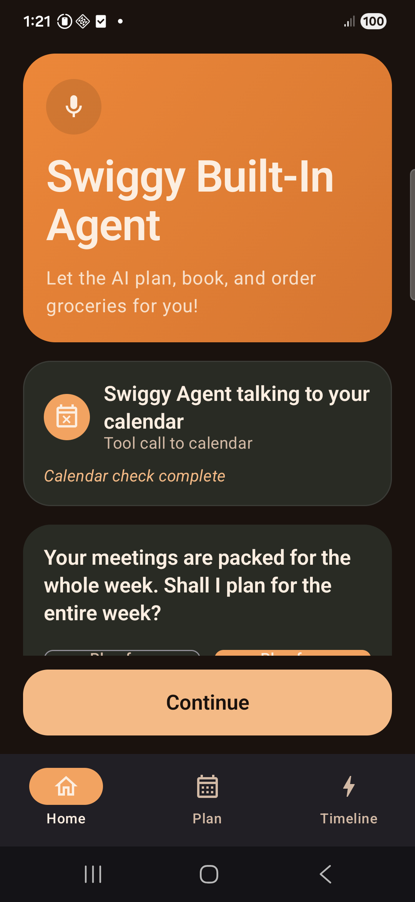
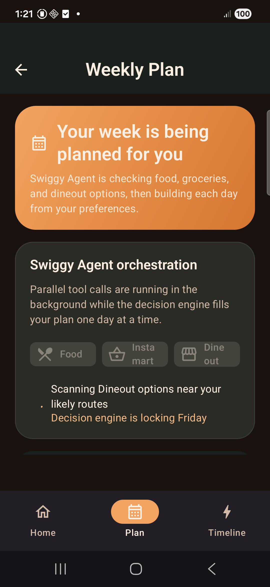
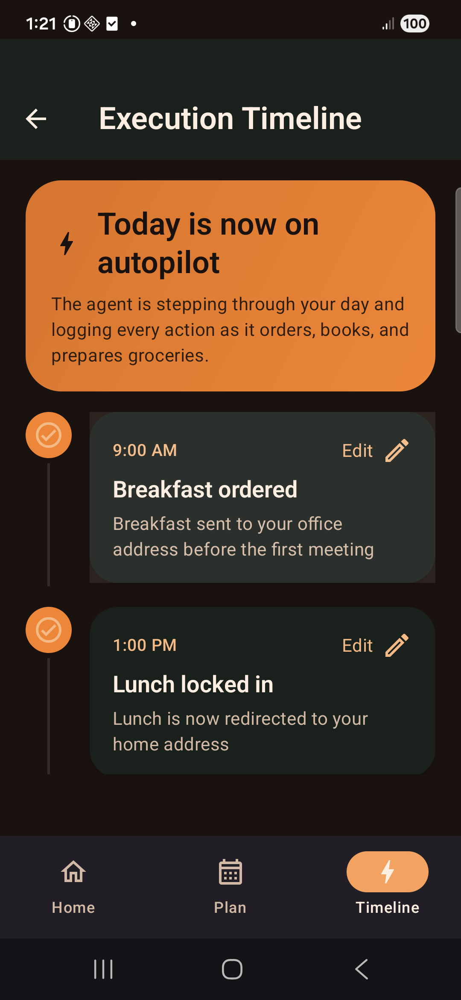

# Swiggy Agent POC

## What this is

This is a Jetpack Compose Android POC for a future-looking Swiggy assistant that can:

- understand a busy schedule
- plan meals for the day or week
- let the user lightly edit decisions
- execute food, dineout, and grocery actions through a single agent experience

The goal is not backend depth. The goal is to show what a Swiggy-native AI assistant could feel like.

## Core idea

A user says: `Plan my week`

The app then:

1. checks calendar context
2. creates a weekly plan
3. lets the user tweak meals
4. shows execution through a timeline

## Why this matters

People do not just want food delivery. They want fewer decisions on busy days.

This POC explores how Swiggy could move from a transactional app to a proactive daily assistant that:

- reduces decision fatigue
- adapts to schedule pressure
- coordinates food, groceries, and dineout in one place

## How agents fit here

This POC is designed to hint at multiple agent roles:

- `Decision agent`: chooses the best plan for each day
- `Skill agents`: breakfast, lunch, dinner, and grocery behaviors
- `Execution agent`: shows how the selected plan gets carried out over the day

That separation makes the system easier to scale later instead of putting all logic into one giant flow.

## What MCP is doing here

In this prototype, MCP is mocked, but the idea is important.

MCP acts like the agent's bridge to external tools and services. In this case, it represents Swiggy capabilities such as:

- Food ordering
- Instamart cart creation
- Dineout suggestions or booking
- Calendar/context lookup

So the agent is not just "thinking". It is also orchestrating actions across tools.

## Problem this solves

Today, users still have to decide:

- what to eat
- where to send it
- whether to dine out
- what groceries are missing

This POC shows how one assistant can manage all of that with much less user effort.

## Current demo flow

- Home screen with mocked calendar analysis
- Weekly planning screen with progressive day-by-day generation
- Edit bottom sheet for meal swaps
- Timeline screen with editable fulfillment choices and grocery cart controls

